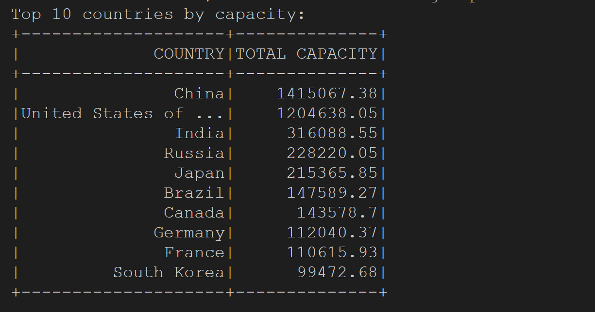
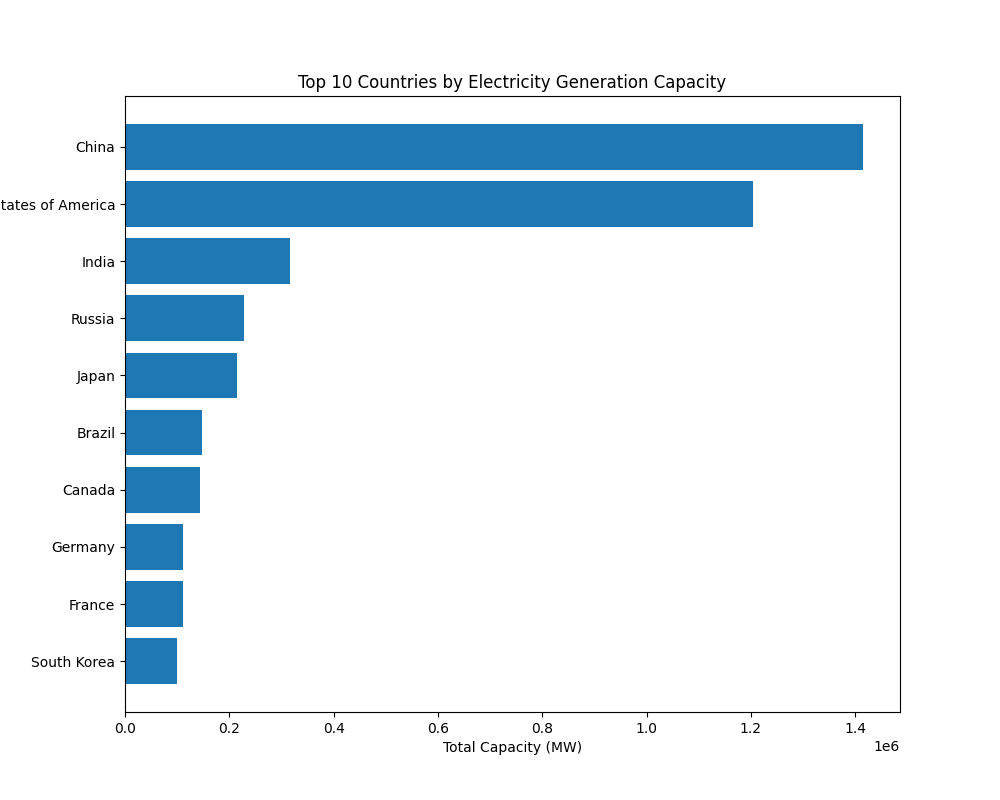

[][def]

# CLI Lab - Week 10 Mini Project

## Python vs Rust Speed Test

The purpose of this project is to use PySpark to perform data processing on a large dataset.

# Dataset Overview:

The [dataset](https://wri-dataportal-prod.s3.amazonaws.com/manual/global_power_plant_database_v_1_3.zip) is a comprehensive, open source dataset of power plants around the world. It centralizes power plant data to make it easier to navigate, compare and draw insights for one’s own analysis. The database covers approximately 35,000 power plants from 167 countries and includes thermal plants

## Mini-project deliverables:

### Top 10 Countries by Electricity Generation Capacity:

### Bottom 10 Countries Electricity Generation Capacity:

### Bar Chart of Top 10 Countries by Electricity Generation Capacity:

[def]: https://github.com/nogibjj/oo46_Mini_Proj_W8/actions/workflows/cicd.yml
